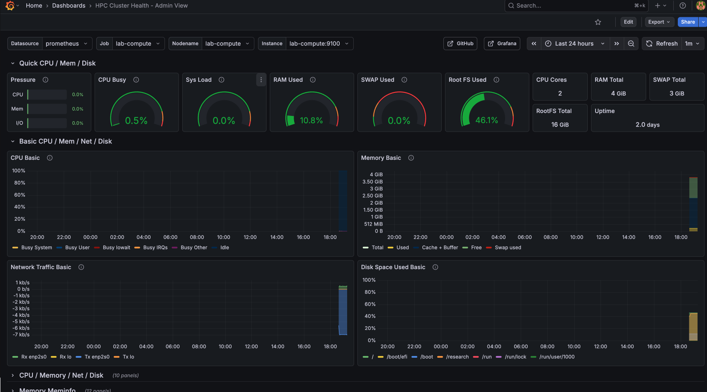
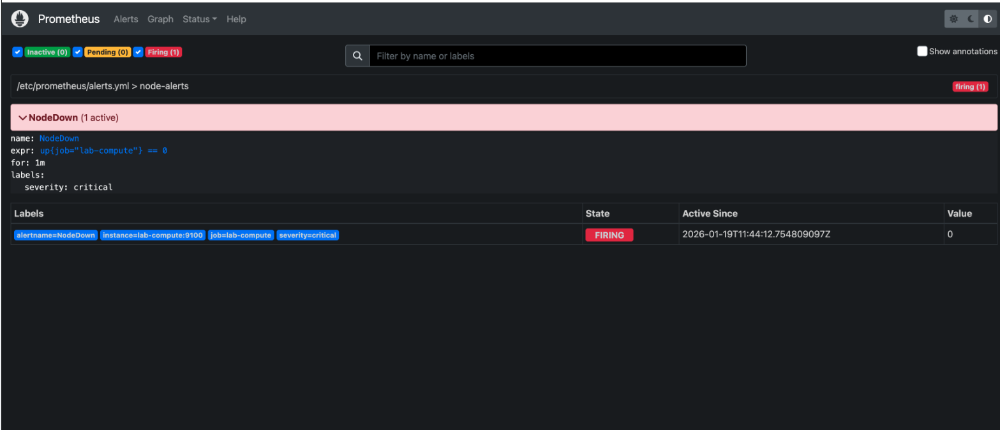
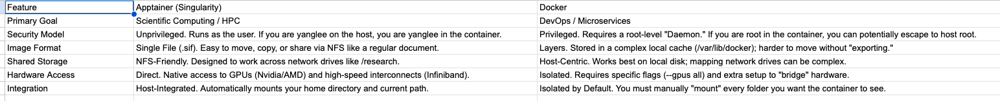

# HPC Extension

This document covers the HPC (High-Performance Computing) extension to the Linux Admin Lab, adding job scheduling, monitoring, and container capabilities to the existing infrastructure.

## Overview

The HPC extension builds on the existing three-node architecture:

| Role | Host | New Services |
|------|------|--------------|
| Controller | lab-admin | slurmctld (Slurm controller) |
| Compute | lab-compute | slurmd (Slurm compute daemon) |
| Backup | lab-backup | (unchanged) |

## Architecture


**Components:**
- **lab-admin (Management Node)**: slurmctld (scheduler), slurmdbd (accounting), MariaDB (storage)
- **lab-compute (Worker Node)**: slurmd (execution), slurmstepd (job steps)
- **MUNGE**: Shared-key authentication between all nodes
- **NFS**: Shared storage at `/research/slurm` for job scripts and output

## Key Components

### Slurm (Phase 1)
- **slurmctld**: Controller daemon on lab-admin — schedules jobs, manages state
- **slurmd**: Compute daemon on lab-compute — executes jobs
- **MUNGE**: Authentication between nodes (shared key)

### Why Slurm?
- Industry-standard HPC job scheduler
- Used at most national labs and universities
- Demonstrates understanding of batch job paradigm vs interactive computing

### Monitoring (Phase 2)
- **Prometheus**: Metrics collection and alerting on lab-admin
- **Grafana**: Visualization dashboards
- **Node Exporter**: Host metrics (CPU, memory, disk) on lab-compute



### Alerting

Proactive failure detection with NodeDown alert:



### Containers (Phase 3)
- **Apptainer**: HPC-style rootless containers on lab-compute
- **SIF images**: Single-file format stored on shared NFS
- **Slurm integration**: Containers executed via sbatch, not interactively

#### Why Apptainer over Docker?



| Feature | Apptainer | Docker |
|---------|-----------|--------|
| Security | Rootless (user=user) | Root daemon required |
| Storage | Single .sif file, NFS-friendly | Layers in /var/lib/docker |
| Integration | Auto-mounts home/cwd | Manual mount required |

## Implementation Phases

- [x] **Phase 1 — Slurm (COMPLETE)**
  - [x] 1.1 — Architecture planning
  - [x] 1.2 — Slurm installation (controller + compute)
  - [x] 1.3 — Job execution, accounting & failure analysis
  - [x] 1.4 — Failure injection & recovery validation
- [x] **Phase 2 — Monitoring (COMPLETE)**
  - [x] 2.1 — Node Exporter on compute node
  - [x] 2.2 — Prometheus on controller
  - [x] 2.3 — Grafana dashboards
  - [x] 2.4 — Alert rules (NodeDown)
- [x] **Phase 3 — Containers (COMPLETE)**
  - [x] 3.1 — Apptainer installation via PPA
  - [x] 3.2 — Slurm integration (sbatch + apptainer exec)
  - [x] 3.3 — Shared storage validation (/research binding)
- [ ] Phase 4 — Ansible automation for HPC
- [ ] Phase 5 — Software stacks (Spack)

## Configuration Files

Key configuration locations:
- `/etc/slurm/slurm.conf` — Main Slurm configuration (must be identical on all nodes)
- `/etc/slurm/slurmdbd.conf` — Database daemon configuration (on controller only)
- `/etc/munge/munge.key` — Shared authentication key

### Accounting Components
- **slurmdbd**: Database daemon storing job history, user associations, fairshare data
- **MariaDB**: Backend database for slurmdbd
- **sacctmgr**: CLI for managing clusters, accounts, users, and associations

## Quick Reference

```bash
# Check cluster status
sinfo

# View job queue
squeue

# Submit a job
sbatch job.sh

# View job history
sacct

# Cancel a job
scancel <jobid>
```

## Validation

Job submission with accounting enforcement working:


Shows: `sbatch` submission → `squeue` running state → output file created with correct permissions.

## Related Documentation

- [HPC Day 1 Log](../logs/hpc-day1.md) — Slurm setup, accounting, failure recovery
- [HPC Day 2 Log](../logs/hpc-day2.md) — Monitoring setup (Prometheus, Grafana, alerting)
- [HPC Day 3 Log](../logs/hpc-day3.md) — Apptainer containers with Slurm integration
