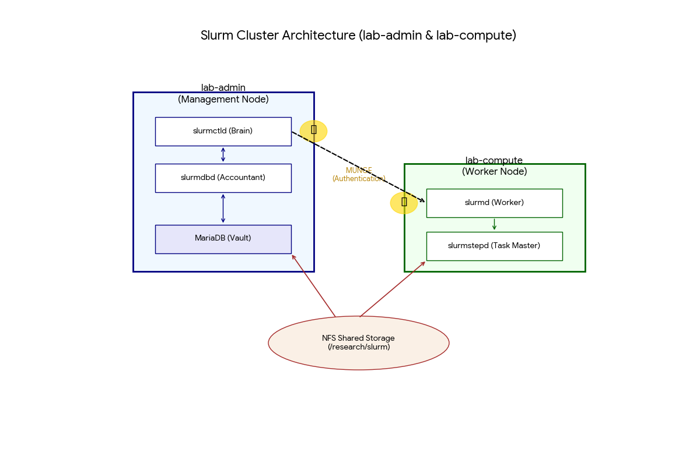
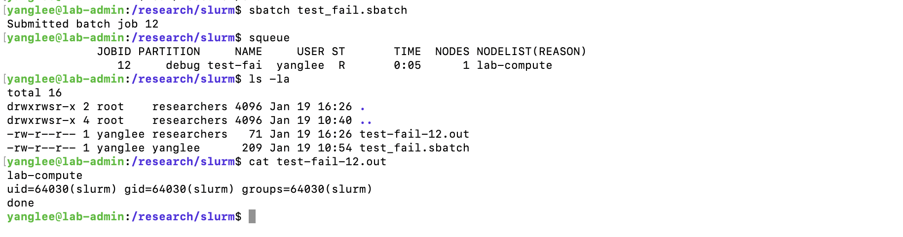

# HPC Extension

This document covers the HPC (High-Performance Computing) extension to the Linux Admin Lab, adding job scheduling, monitoring, and container capabilities to the existing infrastructure.

## Overview

The HPC extension builds on the existing three-node architecture:

| Role | Host | New Services |
|------|------|--------------|
| Controller | lab-admin | slurmctld (Slurm controller) |
| Compute | lab-compute | slurmd (Slurm compute daemon) |
| Backup | lab-backup | (unchanged) |

## Architecture



**Components:**
- **lab-admin (Management Node)**: slurmctld (scheduler), slurmdbd (accounting), MariaDB (storage)
- **lab-compute (Worker Node)**: slurmd (execution), slurmstepd (job steps)
- **MUNGE**: Shared-key authentication between all nodes
- **NFS**: Shared storage at `/research/slurm` for job scripts and output

## Key Components

### Slurm (Phase 1)
- **slurmctld**: Controller daemon on lab-admin — schedules jobs, manages state
- **slurmd**: Compute daemon on lab-compute — executes jobs
- **MUNGE**: Authentication between nodes (shared key)

### Why Slurm?
- Industry-standard HPC job scheduler
- Used at most national labs and universities
- Demonstrates understanding of batch job paradigm vs interactive computing

## Implementation Phases

- [x] **Phase 1 — Slurm (COMPLETE)**
  - [x] 1.1 — Architecture planning
  - [x] 1.2 — Slurm installation (controller + compute)
  - [x] 1.3 — Job execution, accounting & failure analysis
  - [x] 1.4 — Failure injection & recovery validation
- [ ] Phase 2 — Monitoring (Prometheus + Grafana)
- [ ] Phase 3 — Containers (Apptainer/Singularity)
- [ ] Phase 4 — Ansible automation for HPC
- [ ] Phase 5 — Software stacks (Spack)

## Configuration Files

Key configuration locations:
- `/etc/slurm/slurm.conf` — Main Slurm configuration (must be identical on all nodes)
- `/etc/slurm/slurmdbd.conf` — Database daemon configuration (on controller only)
- `/etc/munge/munge.key` — Shared authentication key

### Accounting Components
- **slurmdbd**: Database daemon storing job history, user associations, fairshare data
- **MariaDB**: Backend database for slurmdbd
- **sacctmgr**: CLI for managing clusters, accounts, users, and associations

## Quick Reference

```bash
# Check cluster status
sinfo

# View job queue
squeue

# Submit a job
sbatch job.sh

# View job history
sacct

# Cancel a job
scancel <jobid>
```

## Validation

Job submission with accounting enforcement working:



Shows: `sbatch` submission → `squeue` running state → output file created with correct permissions.

## Related Documentation

- [HPC Day 1 Log](../logs/hpc-day1.md) — Implementation details and troubleshooting
